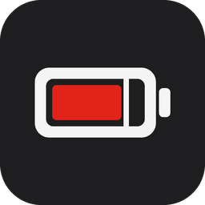

# Lenovo Battery Toggle

**Turn ThinkPad battery charge thresholds on or off with a single key press.**

A tiny Windows app for ThinkPads. Run it once and the charge thresholds go off, so the
battery charges to 100%. Run it again and they come back. Assign it to the F12 key and
you have a dedicated battery-mode switch.

---

## Why this exists

ThinkPads can limit charging with **charge thresholds**: for example, start charging
below 75% and stop at 80%. A laptop that spends most of its life on the charger wears its
battery much more slowly that way, so many owners keep the thresholds on all the time.

Every now and then you need the opposite: a full battery, soon. Before a trip, a long
meeting or a day away from the desk, the thresholds have to go away for a while, and
afterwards they should come back.

Lenovo Vantage can do this, but it takes several clicks in each direction, and it is easy
to forget to switch the thresholds back on. Many ThinkPads, however, have a
**user-defined key (F12)** that can launch any program. This app is the program for that
key: one press switches the mode and tells you which mode you are in now.

## What it does

- **Toggles** charge thresholds: off when they are on, on when they are off.
- **Uses your values** when switching on (default: start below 75%, stop at 80%), set in
  a small settings window.
- **Shows the result** in the corner of the screen for 4 seconds (adjustable from 2 to 10)
  and disappears by itself. No buttons, no window to close, and it does not steal focus from your work:

  > Charge thresholds OFF: the battery charges to 100%.
  >
  > Charge thresholds ON: charging starts below 75%, stops at 80%.

- **Reports the real state.** The message is based on reading the setting back from the
  system after the change, not on what the app intended to do.
- **Speaks Polish or English**, following the Windows display language.
- **Cleans up after itself.** Uninstalling switches the thresholds off and removes every
  file the app created.

## What it does not do

- **It does not run in the background.** No tray icon, no service, no scheduled task. It
  starts, switches, shows the message and exits (about 5 seconds in total). The only window
  is the optional settings window.
- **It does not change thresholds on a schedule** or by battery level. It switches only
  when you run it.
- **It does not replace Lenovo Vantage.** Vantage is not needed, but if you have it, both
  work side by side and the switch in Vantage shows the state set by this app.
- **It does not install drivers** and does not modify the system. It relies on the Lenovo
  driver that Windows Update installs on ThinkPads.
- **It does not include any Lenovo software.** The one Lenovo tool it uses is downloaded
  from Lenovo, see below.
- **It does not collect or send any data.** The only network access is the one-time
  download of the Lenovo tool from `download.lenovo.com`.
- **It does not work on non-Lenovo laptops** or on Lenovo models without charge-threshold
  support in firmware.

## How it works

The app does not talk to the battery itself. It uses Lenovo's own building blocks, the
same ones Lenovo Vantage uses:

```
 your key press
      │
      ▼
 lenovo-battery-toggle.exe          this app: decides on/off, shows the message
      │  runs
      ▼
 ChargeThreshold.exe                Lenovo's official command-line tool
      │  asks
      ▼
 Lenovo Power and Battery driver    installed by Windows Update on ThinkPads
      │  sets
      ▼
 battery controller (firmware)      keeps the thresholds, even when Windows is off
```

### About ChargeThreshold.exe

`ChargeThreshold.exe` is a small command-line tool published by Lenovo for setting charge
thresholds from scripts, without Vantage
([Lenovo knowledge base article](https://forums.lenovo.com/t5/Lenovo-Vantage-Knowledge-Base/Q-amp-A-setting-a-ThinkPad-battery-charge-threshold-by-script/ta-p/4345631)).
It belongs to Lenovo, so this project does not redistribute it. Instead:

- the app **downloads it from Lenovo** (`download.lenovo.com`) once, during installation
  (or on first use, if the download during installation failed),
- it **checks the digital signature** and uses the file only if it is validly signed by
  Lenovo; otherwise the file is deleted,
- it keeps the file in the app's data folder, or, with an all-users installation, in the
  program folder, which only administrators can change: the uninstaller runs with
  administrator rights and may use only that copy, never one from your profile,
- it runs the file in the background, without a console window.

The app calls it with three commands: `status` (read the current state), `on <stop> <start>`
and `off`.

## Requirements

- A **ThinkPad** with **Windows 10 or 11**.
- The **Lenovo Power and Battery** driver. Windows Update installs it automatically on
  ThinkPads; it is also available from Lenovo Support as package
  [DS541411](https://support.lenovo.com/us/en/downloads/ds541411). The installer checks for it
  and tells you if it is missing.
- **Internet access during installation**, for the download of `ChargeThreshold.exe`.

Nothing else: the app runs on .NET Framework 4.8, which is part of Windows 10 and 11.

## Installation

1. Download `lenovo-battery-toggle-<version>-setup.exe` from the
   [latest release](https://github.com/george7979/lenovo-battery-toggle/releases/latest).
2. Run it. The installer is not code-signed, so Windows SmartScreen may show
   "Windows protected your PC": choose **More info → Run anyway**.
3. Choose the install mode:
   - **Install for me only** — no administrator rights; installs to
     `%LOCALAPPDATA%\Programs\Lenovo Battery Toggle`.
   - **Install for all users** — asks for administrator rights; installs to
     `C:\Program Files\Lenovo Battery Toggle`.
4. On the **Charge thresholds** page choose the values used when the thresholds are on.
5. At the end the installer downloads and verifies `ChargeThreshold.exe`, so the first
   key press works even offline.
6. The last page says whether the thresholds are on or off right now and offers
   **Switch charge thresholds on now** (checked). Leave it checked and the thresholds are
   switched on with your values when you click Finish, confirmed by the usual
   notification; uncheck it and they stay as they are. (On a repair with the thresholds
   already on, the option applies the values from the threshold page.)

Running the installer when the app is already installed shows where it is installed and
offers two choices:

- **Repair** — restores the program files and shortcuts in the same place and keeps your
  settings; this is also how you update to a newer version,
- **Uninstall** — removes the app (both installations, if it is installed for you and for
  all users).

To switch between "for me" and "for all users", uninstall and install again.

## Usage

Starting the app is the whole interface: every start toggles the thresholds. (The
*Lenovo Battery Toggle Settings* shortcut is the exception; it opens the settings window.)

- **Start menu** → *Lenovo Battery Toggle*.
- **The F12 user-defined key.** In Lenovo Vantage, open the setting of the user-defined key
  (the menu name depends on the Vantage version), choose the action that opens an
  application or file, and paste the full path of `lenovo-battery-toggle.exe`
  (`AppData` is a hidden folder, so pasting is easier than browsing).
- **A Windows keyboard shortcut**, without Vantage. Right-click the Start menu entry →
  *Open file location* → *Properties* of the shortcut → **Shortcut key**, for example
  `Ctrl+Alt+B`. With an all-users installation Windows asks for administrator rights to
  save the change.

## Configuration

Start menu → **Lenovo Battery Toggle Settings** opens a small window:

- **Start charging below** — charging starts when the battery drops below this level,
- **Stop charging at** — charging stops at this level,
- **Show the notification for** — how long the message stays on screen, 2 to 10 seconds
  (error messages always stay 6 seconds).

The threshold fields accept only numbers from 0 to 100, and **Save** stays disabled until
start is lower than stop, so the settings cannot be broken by a typo. If the thresholds are on at
that moment, the new values are applied right away; otherwise they are used the next time
the app switches the thresholds on.

The values are stored in `%LOCALAPPDATA%\LenovoBatteryToggle\config.json`
(`{"start": 75, "stop": 80, "notificationSeconds": 4}`); editing the file by hand also
works. Invalid thresholds are reported instead of used; a notification time outside 2–10
is brought into that range.

## Files on your computer

| Location | Content |
|---|---|
| Program folder (see Installation) | `lenovo-battery-toggle.exe` with its `.config` file, the settings icon, the uninstaller and, for an all-users installation, `ChargeThreshold.exe` |
| `%LOCALAPPDATA%\LenovoBatteryToggle\` | `config.json` (your thresholds) and, for a per-user installation, `ChargeThreshold.exe` (downloaded from Lenovo) |
| Start menu | *Lenovo Battery Toggle* and *Lenovo Battery Toggle Settings* |

Apart from the standard entry in Windows Apps, created by the installer, nothing else is
written: no registry settings, no services, no scheduled tasks, no logs. The Lenovo driver
itself records the threshold state in its own registry key, exactly as it does when you use
Vantage.

## Uninstall

Windows Settings → Apps → **Lenovo Battery Toggle** → Uninstall. The uninstaller:

1. switches the charge thresholds **off**, so the battery returns to its factory behaviour,
2. deletes the program folder, the whole `%LOCALAPPDATA%\LenovoBatteryToggle` folder and
   the Start menu entries.

This works the same whether you uninstall from Windows Settings or with the installer's
**Uninstall** action.

With an all-users installation, settings are per user: the uninstaller removes the data
folder of the user who runs it.

## Troubleshooting

**"The Lenovo Power and Battery driver is missing"** — run Windows Update, or install
package DS541411 from Lenovo Support.

**"Could not download ChargeThreshold.exe"** — the installer and the app show this when the
download fails: no internet connection, a firewall blocking `download.lenovo.com`, or the
file is no longer available at Lenovo. The app retries on the next run. To install the file
by hand, download

```
https://download.lenovo.com/pccbbs//thinkvantage_en/metroapps/Vantage/ChargeThreshold/ChargeThreshold.exe
```

and save it as `%LOCALAPPDATA%\LenovoBatteryToggle\ChargeThreshold.exe`. The app accepts
it only with a valid Lenovo signature, and the uninstaller removes it like any other file
of the app. The message window can be copied with Ctrl+C. With an all-users installation,
also run the installer's **Repair** once the download works again: it puts a copy in the
program folder, which the uninstaller needs to switch the thresholds off.

**The switch in Lenovo Vantage always shows "off", although the thresholds work.** Vantage
reads the state from a registry branch that the driver creates only when it is installed
for the first time. If that branch is missing, or still describes the battery of another
laptop (for example after moving the disk from another ThinkPad), reinstall the driver from
scratch: in an administrator terminal run
`pnputil /remove-device` for the *Lenovo Power and Battery* device and
`pnputil /delete-driver` for its `powermgr.inf` package, then restart. Windows Update
installs the driver again and creates the branch.

## Building from source

Requires the .NET SDK (8 or newer) and Inno Setup 7 on Windows:

```powershell
.\build.ps1 -Version 0.1.1 -Iscc "C:\path\to\ISCC.exe"
```

The installer is written to `artifacts\`. Architecture and test procedure:
[docs/TECH.md](docs/TECH.md). Development happens on `dev`; releases are merged to `main`
and tagged `v<version>`, and GitHub Actions then publishes the installer as a release.
Changes between versions: [CHANGELOG.md](CHANGELOG.md).

## Disclaimer

This is an independent project, not affiliated with or endorsed by Lenovo. Lenovo,
ThinkPad and Vantage are trademarks of Lenovo. Use at your own risk.

## License

[MIT](LICENSE)
